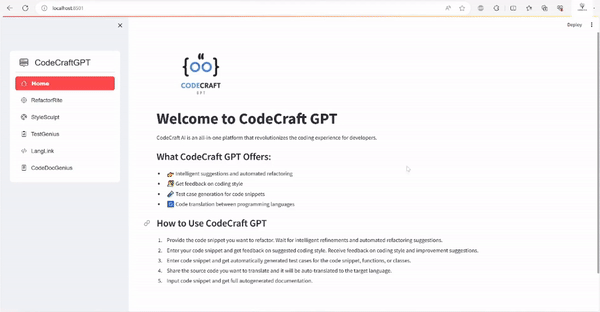

# Multi-Model-AI-ToolKit

<br>
Multi-Model-AI-ToolKit is an innovative, all-in-one platform harnessing the power of advanced Language Models (OpenAI). It seamlessly integrates multiple AI-powered functionalities to elevate the coding and data analysis experience for developers and data scientists.

## Demo



## Prerequisites

Before using this application, ensure you have the following prerequisites in place:

1. **Python:**
    - This project requires **Python 3.8 >= 3.11.** Ensure you have Python installed on your system.
    - You can download Python from the [official Python website](https://www.python.org/downloads/).
&nbsp;
2. **OpenAI API Key:**
   - To access certain features and functionalities, you'll need a valid [OpenAI API key](https://platform.openai.com/api-keys).
   - If you don't have an API key, you can obtain one by following the instructions on the [OpenAI platform](https://platform.openai.com/signup).
&nbsp;
3. **LangChain:**
    - LangChain is a framework designed to simplify the creation of applications using large language models. As a language model integration framework, LangChain's use cases include document analysis and summarization, chatbots, and code analysis. Learn about [LangChain](https://python.langchain.com/).
&nbsp;
4. **Streamlit:**
    - Streamlit is a free and open-source framework to rapidly build and share beautiful machine learning and data science web apps. It is a Python-based library specifically designed for machine learning engineers. Learn about [Streamlit](https://streamlit.io/). [Installation requirements](https://docs.streamlit.io/library/get-started/installation)
&nbsp;
5. **Streamlit-Option-Menu:**
    - streamlit-option-menu is a simple Streamlit component that allows users to select a single item from a list of options in a menu. It is similar in function to st.selectbox(), except that: It uses a simple static list to display the options instead of a dropdown. Learn about [Streamlit-Option-Menu](https://github.com/victoryhb/streamlit-option-menu).

## How to Set Up the Project Locally

Follow these steps to set up the project:

1. Navigate to your workspace.
2. Create a virtual environment by running: 
    ```bash
    python -m venv env
    ```
3. Activate your virtual environment based on your operating system:

    ```bash
    # Windows
    env/Scripts/activate

    # Linux or MacOS
    source env/bin/activate
    ```

4. Install dependencies by running the command:
    ```bash
    pip install -r requirements.txt
    ```

5. Run the application using the following command:
    ```bash
    streamlit run main.py
    ```

Ensure you follow these steps to successfully set up and run the project. You're ready to explore the full capabilities of the Multi-Model-AI-ToolKit.

## Key Features

### Chat with Documents 🤖

Engage with documents through a conversational interface, powered by AI, for extracting insights and answering queries.

### Chat with Documents using RAG (Retrieval-Augmented Generation) 📄

An enhanced document analysis tool that integrates RAG for more accurate and contextually rich responses.

### Image-to-Text Conversion 🖼️

Convert images into text using AI-powered Optical Character Recognition (OCR) capabilities.

### Text Summarization 📝

Generate concise summaries from long documents or text inputs with AI-powered summarization tools.

### TestGenius (Code Testing and Test Case Generation) 🧪

Effortlessly create reliable and comprehensive test cases for code snippets, functions, or classes to ensure correctness and improve test coverage.

### LangLink (Code Translation and Cross-Language Compatibility) 🌐

Translate code between programming languages seamlessly with AI-powered code translation tools, ensuring compatibility across different environments.

### CodeDocGenius (Code Documentation) 📚

Automatically generate comprehensive documentation for codebases, improving code understanding and maintainability.

### Database Management 📊

A suite of tools for interacting with and managing databases, making database handling easier and more efficient.

## Technologies Used

1. [Python](https://www.python.org/downloads/)
2. [OpenAI](https://platform.openai.com/)
3. [LangChain](https://python.langchain.com/)
4. [Streamlit](https://streamlit.io/)


<!-- ## Examples

we will Provide code examples or usage scenarios to help users understand how to use the project in real-world situations.[if any] -->

<!-- ## Contributing

we will explain how others can contribute to the project, including guidelines for reporting issues or submitting pull requests. -->

<!-- ## Testing

We will outline any testing procedures or instructions for users to validate the project. -->

<!-- ## License

we will clearly state the project's license, providing information on how others can use, modify, and distribute the code. -->

<!-- ## Acknowledgments

We will give credit to contributors, libraries, or tools that have been instrumental in the development of the project. -->

<!-- ## Contact Information

we will provide ways for users to contact the project lead or maintainers. -->

<!-- ## FAQs (Frequently Asked Questions):

section for common questions and answers to address potential issues or concerns. -->

<!-- ## Changelog

Log of changes made to the project, including version updates and release notes. -->

<!-- ## Additional Resources

Link to any external documentation, tutorials, or related resources that can help users understand or extend the project. -->


## Members

### Main Developers/ Original Developers

- **[Philip Mutua](https://github.com/pmutua)**
  - Role: Team Lead and Developer

- **[Tusiime Ronald](https://github.com/tron66)**
  - Role: Developer

- **[Harrison Wachira](https://github.com/hnjogu)**
  - Role: Developer
