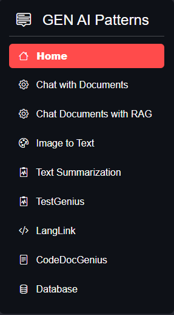

# CodeCraftGPT

 
CodeCraft GPT is an innovative, all-in-one platform harnessing the power of advanced Language Models (OpenAI). It seamlessly integrates four key components to elevate the coding experience for developers.

# Streamlit App README

Welcome to our Streamlit app! This application provides various functionalities to assist developers in their coding tasks. Below are the features available:

## 1. Question Answering with Large Documents using LangChain

LangChain is an advanced natural language processing tool that enables users to perform question answering tasks with large documents efficiently. It employs state-of-the-art language models to comprehend complex text data and provide accurate answers to user queries, even when dealing with extensive documents.

## 2. Question Answering Large Documents with RAG Pattern

The RAG (Retrieval-Augmented Generation) pattern is a cutting-edge approach to question answering that leverages large-scale retrievers and generative models. This feature allows users to extract relevant information from large documents using advanced retrieval techniques and generate concise, contextually relevant answers to their queries.

## 3. Image to Text Conversion

The Image to Text Conversion feature utilizes optical character recognition (OCR) technology to extract text from images. It enables users to convert images containing text into editable text format, facilitating further processing and analysis of textual information contained within images.

## 4. StyleSculpt - Code Style Checker

StyleSculpt is an intelligent code style checker designed to ensure code quality and adherence to coding standards. It analyzes code snippets, identifies stylistic inconsistencies, and provides actionable feedback to improve coding practices. By enforcing best practices and coding conventions, StyleSculpt enhances code readability, maintainability, and consistency across projects.

## 5. TestGenius - Code Testing and Test Case Generation

TestGenius is a powerful tool that empowers developers to create reliable and comprehensive test suites effortlessly. Using advanced artificial intelligence techniques, TestGenius automatically generates test cases for code snippets, functions, or classes. It analyzes code logic, boundary conditions, and edge cases to produce high-quality test cases, thereby accelerating the development cycle and ensuring robust software quality.

## 6. LangLink - Code Translation and Cross-Language Compatibility

LangLink is an innovative tool that facilitates smooth code translation between programming languages. Powered by artificial intelligence, LangLink overcomes language barriers and ensures compatibility and seamless transitions across different programming languages. Developers can confidently migrate codebases, leverage libraries written in other languages, and collaborate with teams working in diverse linguistic environments.

## 7. CodeDocGenius - Code Documentation Generator

CodeDocGenius automates the process of generating documentation for code snippets in any programming language. By analyzing code structure, comments, and documentation conventions, CodeDocGenius produces comprehensive and well-formatted documentation, enhancing code readability and understanding. It saves developers time and effort by eliminating the need for manual documentation tasks, enabling them to focus on coding and problem-solving.

## 8. Database - Database Query Question

The Database feature provides an AI-powered tool to assist in generating queries for database operations. It analyzes user input, database schema, and query requirements to generate SQL queries that retrieve desired data efficiently. Whether querying relational databases, NoSQL databases, or data warehouses, the Database feature streamlines the query writing process and enhances productivity for database developers and analysts.

Feel free to explore and utilize these features to streamline your development process. If you have any questions or feedback, please don't hesitate to reach out. Happy coding!
